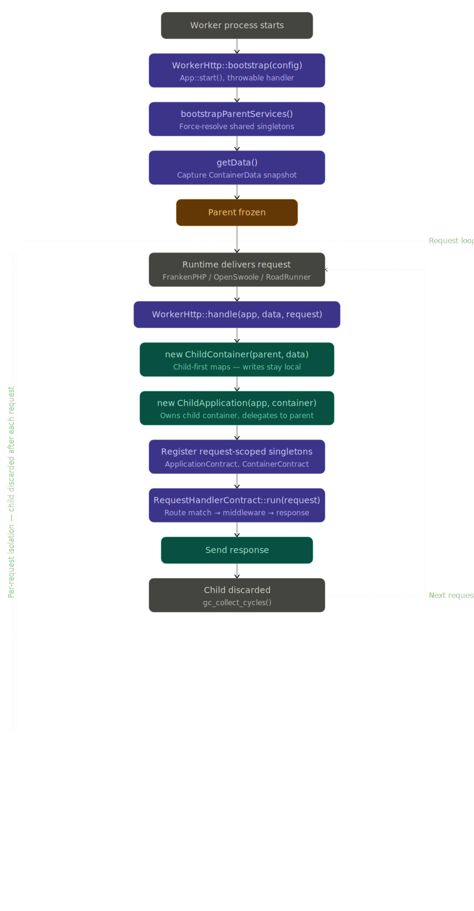

# Valkyrja Art

This repository contains art assets for the [Valkyrja](https://valkyrja.io) framework.

## Contents

- [Banners](#banners)
- [Full Logos](#full-logos)
- [Thumbnail Logos](#thumbnail-logos)
- [Flow Charts](#flow-charts)

---

## Banners

### Long Banner

| Variant | Preview                                    |
|---------|--------------------------------------------|
| Default |  |
| PHP     |          |
| Java    |        |

---

## Full Logos

### Orange

| Variant | Preview                                  |
|---------|------------------------------------------|
| Default |  |
| PHP     |          |
| Java    |        |

---

## Thumbnail Logos

### Orange

| Variant | Preview                                       |
|---------|-----------------------------------------------|
| Default |  |

### Blue

| Variant | Preview                                     |
|---------|---------------------------------------------|
| Default |  |
| White   |      |

---

## Flow Charts

### PHP

| Chart                 | Preview                                                             |
|-----------------------|---------------------------------------------------------------------|
| CLI Lifecycle         |                  |
| HTTP Lifecycle        |                |
| Worker HTTP Lifecycle |  |
| Exception Hierarchy   |      |

### All Languages

| Chart               | Preview                                                         |
|---------------------|-----------------------------------------------------------------|
| Exception Hierarchy |  |

### Go

| Chart               | Preview                                                        |
|---------------------|----------------------------------------------------------------|
| Exception Hierarchy |  |

### Java

| Chart               | Preview                                                          |
|---------------------|------------------------------------------------------------------|
| Exception Hierarchy |  |

### Python

| Chart               | Preview                                                            |
|---------------------|--------------------------------------------------------------------|
| Exception Hierarchy |  |

### TypeScript

| Chart               | Preview                                                                |
|---------------------|------------------------------------------------------------------------|
| Exception Hierarchy |  |