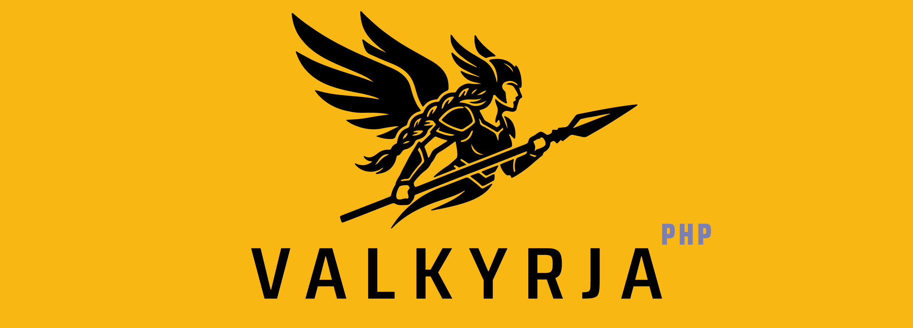
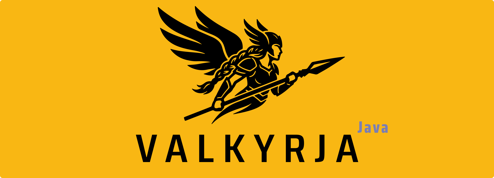
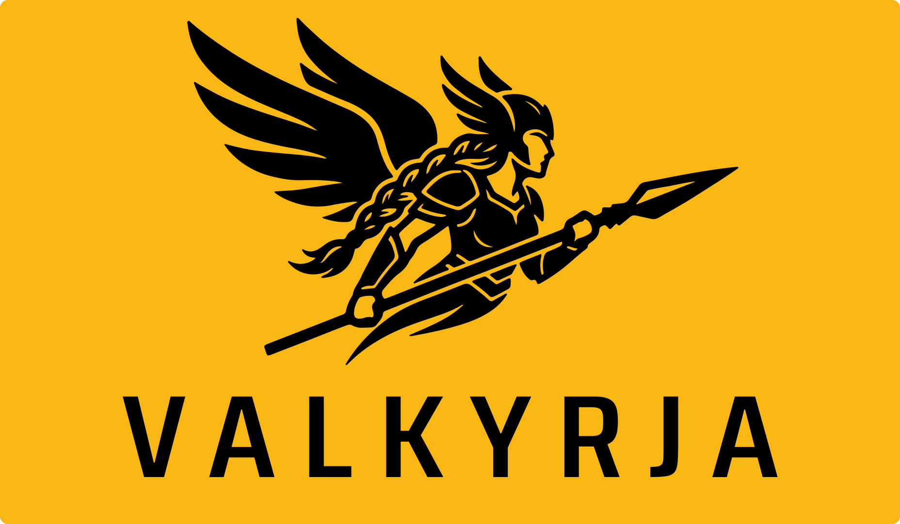
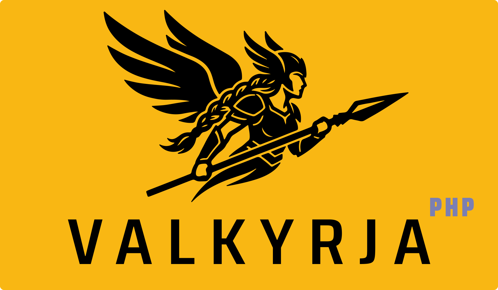
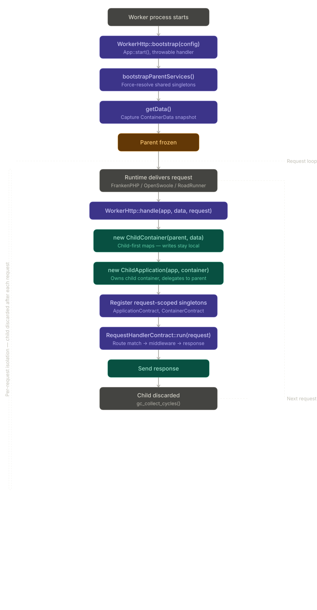

<p align="center"><a href="https://valkyrja.io" target="_blank">
    
</a></p>

# Valkyrja Art

Art assets for the [Valkyrja][valkyrja url] project — banners, logos, and
flow charts used across the framework, its ecosystem repositories, and the
valkyrja.io website.

This repository is the canonical source for Valkyrja's visual identity. If
you need a logo for a README, a banner for a presentation, or a lifecycle
diagram for documentation, it lives here.

What's Included
---------------

- **Banners** — wide repository banners in language-specific variants
- **Full logos** — the primary Valkyrja mark in language-specific variants
- **Thumbnail logos** — compact marks suitable for avatars and favicons
- **Flow charts** — lifecycle and architecture diagrams per language

Banners
-------

Wide banners suitable for repository READMEs, documentation headers, and
social cards.

### Orange

| Variant | Preview                                    |
| ------- | ------------------------------------------ |
| Default |  |
| PHP     |          |
| Java    |        |

Full Logos
----------

The primary Valkyrja mark, including wordmark.

### Orange

| Variant | Preview                                  |
| ------- | ---------------------------------------- |
| Default |  |
| PHP     |          |
| Java    |        |

Thumbnail Logos
---------------

Compact marks suitable for avatars, favicons, and other small-format uses.

### Orange

| Variant | Preview                                       |
| ------- | --------------------------------------------- |
| Default |  |

### Blue

| Variant | Preview                                     |
| ------- | ------------------------------------------- |
| Default |  |
| White   |      |

Flow Charts
-----------

Lifecycle and architecture diagrams used in Valkyrja documentation.

### All Languages

Cross-language diagrams that apply to every port.

| Chart               | Preview                                                         |
| ------------------- | --------------------------------------------------------------- |
| Exception Hierarchy |  |

### PHP

| Chart                 | Preview                                                             |
| --------------------- | ------------------------------------------------------------------- |
| CLI Lifecycle         |                  |
| HTTP Lifecycle        |                |
| Worker HTTP Lifecycle |  |
| Exception Hierarchy   |      |

### Java

| Chart               | Preview                                                          |
| ------------------- | ---------------------------------------------------------------- |
| Exception Hierarchy |  |

### Go

| Chart               | Preview                                                        |
| ------------------- | -------------------------------------------------------------- |
| Exception Hierarchy |  |

### Python

| Chart               | Preview                                                            |
| ------------------- | ------------------------------------------------------------------ |
| Exception Hierarchy |  |

### TypeScript

| Chart               | Preview                                                                |
| ------------------- | ---------------------------------------------------------------------- |
| Exception Hierarchy |  |

Usage
-----

Link directly to the raw file from GitHub for use in READMEs, documentation,
and external sites:

```
https://raw.githubusercontent.com/valkyrjaio/art/refs/heads/master/{path-to-asset}
```

For example, the default long banner used in ecosystem READMEs:

```
https://raw.githubusercontent.com/valkyrjaio/art/refs/heads/master/long-banner/orange/default.png
```

Contributing
------------

New assets and refinements to existing ones are welcome. See
[`CONTRIBUTING.md`][contributing url] for the submission process,
[`REPOSITORY_NAMING.md`][repository naming url] for how repos are named, and
[`VOCABULARY.md`][vocabulary url] for terminology used across the project.

When adding new assets, follow the existing directory structure:
`{asset-type}/{color-variant}/{language-variant}.{ext}`.

License
-------

This repository holds two kinds of material, and each kind has its own terms.

The brand assets in `full-logo/`, `long-banner/`, and `thumbnail-logo/` are all
rights reserved. You may show an unmodified brand asset to refer to the Valkyrja
project, such as a link from your own README. Every other use needs permission.

Everything else is licensed under the [MIT license][MIT license url]. This
includes the diagrams in `flow-charts/` and the workflow configuration.

See [`LICENSE.md`](./LICENSE.md) for the full terms.

[valkyrja url]: https://valkyrja.io
[contributing url]: https://github.com/valkyrjaio/.github/blob/26.x/CONTRIBUTING.md
[repository naming url]: https://github.com/valkyrjaio/.github/blob/26.x/REPOSITORY_NAMING.md
[vocabulary url]: https://github.com/valkyrjaio/.github/blob/26.x/VOCABULARY.md
[MIT license url]: https://opensource.org/licenses/MIT
